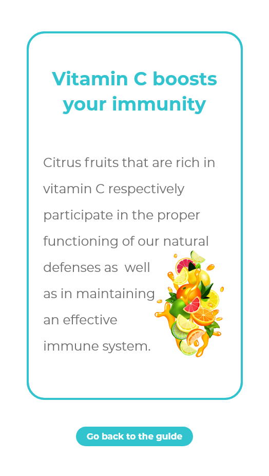

# SihatiMob
  

# [ESI](https://esi.dz) 1CS Year Project 

## "An Android Health Platform for the Algerian People " 

    

## The Demo & ScreenShoots : 

    
    
    
    
    
    
_________________________ 
<b> 
You can Also check the Demo on Youtube from :  
<a href="https://www.youtube.com/watch?v=6evijHYMHk0">here </a>    </b>

 
## The Team 

The app was Designed By 
<b> Azyadi Zouaghi  </b>
You can check her github from : <a href="https://github.com/azyazouaghi"> here </a>  
with a little bit of help by Me . And i was the one who developed The App Using Android Studio / java / Xml .
 
 
## Join development!

**Build status:**  
The app is not completed yet (Some Features need a little bit of improvement & why not add more features ..) , so if you wanna help improving it 
just inbox us on any of these e-mails :

### Hamza Bendahmane :  kh_bendahmane@esi.dz  
### Azyadi Zouaghi :  ia_zouaghi@esi.dz    

## Join testing!

**Through Github**

1. Download The app from  <a href="https://github.com/hamza0bendahmane/SihatiMob/blob/master/app/src/main/SihatiMob.apk"> here </a>
2. Install the App ,Try It and Don't forget to hit us with any suggestions or Notes .

**Through Play Sore**

 Not Available Yet .
